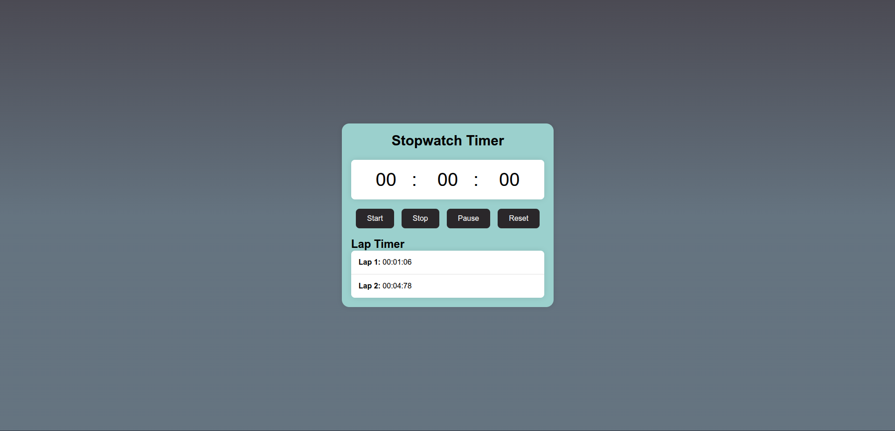

# ⏱️ Stopwatch Timer Application

**Day 1 of 20 Projects in 20 Days Challenge**

A fully functional stopwatch timer built with vanilla HTML, CSS, and JavaScript. Features precision timing, lap recording, and a clean, responsive design.

## 🌟 Features

- **Precision Timing**: Tracks minutes, seconds, and centiseconds (hundredths of a second)
- **Start/Pause/Stop Controls**: Full control over timer functionality
- **Lap Recording**: Record and display multiple lap times
- **Reset Function**: Clear timer and lap history
- **Responsive Design**: Works seamlessly across different screen sizes
- **Modern UI**: Clean gradient background with glassmorphism effects

## 🚀


*Live demo: https://stop-watch-day01.netlify.app/*

## 🛠️ Technologies Used

- **HTML5**: Semantic structure and accessibility
- **CSS3**: Modern styling with gradients and transitions
- **Vanilla JavaScript**: Core functionality and DOM manipulation
- **No external dependencies** - Pure web technologies only

## 📁 Project Structure

```
project-01-stopwatch-timer/
├── index.html          # Main HTML structure
├── style.css           # Styling and responsive design
├── script.js           # JavaScript functionality
└── README.md           # Project documentation
```

## ⚡ Quick Start

1. **Clone or download** the project files
2. **Open `index.html`** in your web browser
3. **Start timing!** Use the control buttons to operate the stopwatch

## 📚 What I Learned

This project helped me understand:
- **JavaScript Timers**: Using `setInterval()` and `clearInterval()`
- **DOM Manipulation**: Dynamic content updates and event handling
- **CSS Styling**: Modern design techniques and responsive layouts
- **Project Structure**: Organizing code across multiple files
- **User Experience**: Creating intuitive controls and feedback

## 🏆 20 Projects Challenge

This stopwatch timer is **Project #1** in my 20 Projects in 20 Days challenge. Follow along as I build a new project each day to improve my web development skills!

### Challenge Goals:
- ✅ Build functional, real-world applications
- ✅ Practice vanilla JavaScript fundamentals
- ✅ Improve CSS and design skills
- ✅ Learn project organization and documentation

## 🤝 Contributing

Found a bug or have a suggestion? Feel free to:
1. Open an issue
2. Submit a pull request
3. Share your feedback

## 🔗 Connect

- **GitHub**: [https://github.com/Ra7imX]
- **Twitter**: [https://x.com/_Ra7imX]
- **LinkedIn**: [https://www.linkedin.com/in/abderrahim-abbad-663371333/]

---

⭐ **Star this repo** if you found it helpful!

**Next Project**: Coming tomorrow! Stay tuned for Day 2 of the challenge.